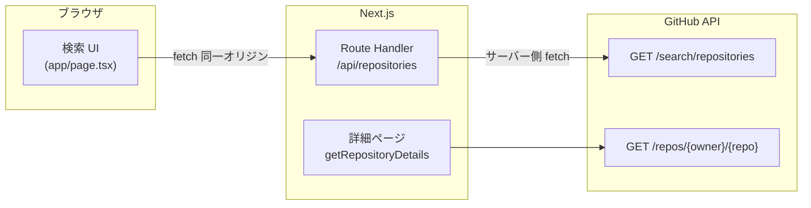
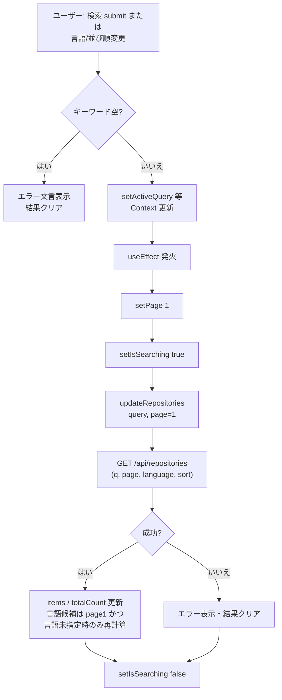
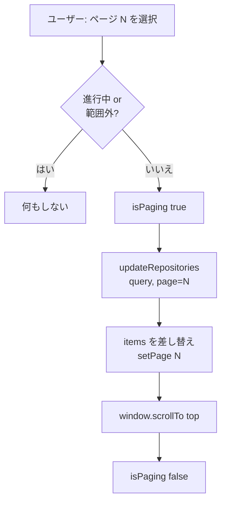
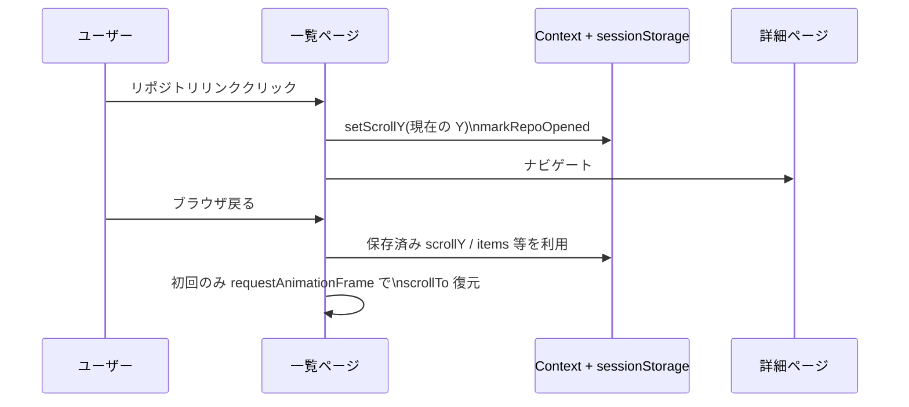

# Git Repo Search

GitHub の **リポジトリ検索 API** を利用し、キーワード検索・言語フィルター・並び替え・**ページネーション**・詳細表示までを一気通貫で行う **Next.js 16（App Router）** アプリケーションです。

一覧から詳細へ遷移したあと **ブラウザの戻る** で検索結果に戻った際も、**クエリ・結果・ページ・スクロール位置** が維持されるよう React Context で状態を共有しています。UI は日本語を主とし、モバイルでも読みやすいレイアウトを意識しています。

---

## 目次

1. [主な機能](#主な機能)
2. [システム構成](#システム構成)
3. [処理フロー（Mermaid）](#処理フローmermaid)
4. [技術スタック](#技術スタック)
5. [ディレクトリ構成](#ディレクトリ構成)
6. [セットアップ](#セットアップ)
7. [npm スクリプト](#npm-スクリプト)
8. [SEO](#seo)
9. [内部 API 仕様](#内部-api-仕様)
10. [実装上の注意](#実装上の注意)
11. [今後の改善案](#今後の改善案)

---

## 主な機能

| 区分 | 内容 |
|------|------|
| **検索** | キーワード入力 → GitHub `search/repositories` 相当の検索（アプリ内プロキシ経由） |
| **フィルター** | 検索実行後に言語セレクトを表示。第 1 ページ結果から言語候補を集計し頻度順で提示 |
| **並び順** | スター / フォーク / 更新日 の昇順・降順 |
| **ページネーション** | GitHub の件数上限（実質 1000 件）を踏まえたページ切り替え。ページ変更時は画面上部へスクロール |
| **一覧 UI** | カード表示（アバター・名前・説明・言語・スター）。開いたリポジトリはリンク色で区別 |
| **詳細** | オーナー名・リポジトリ名をそれぞれ GitHub へのリンクに分割。統計は数値カウントアップ表示。クローン URL コピー |
| **状態保持** | 検索状態・`sessionStorage` によるスクロール位置の復元 |
| **SEO** | ルートの `metadata`・`sitemap`・`robots`・詳細ページの `generateMetadata` と JSON-LD |

---

## システム構成

クライアント側の検索は **自前の Route Handler** 経由で GitHub に到達します。リポジトリ詳細は **サーバーコンポーネント** から GitHub REST API を直接呼び出します。



---

## 処理フロー（Mermaid）

### 検索・再検索（キーワード・言語・並び順）

`activeQuery`・`activeLanguage`・`activeSort` のいずれかが変わると、**常に 1 ページ目から** 再取得します（`useEffect` + `updateRepositories`）。



### ページネーション

一覧の **「次のページ」** 等は、**同じ `activeQuery` のまま** `page` だけ変えて再取得します（`append` による無限スクロールは使いません）。



### 詳細へ遷移とスクロール復元



---

## 技術スタック

| 領域 | 採用技術 |
|------|----------|
| フレームワーク | **Next.js 16**（App Router、Turbopack 開発） |
| 言語 | **TypeScript** |
| スタイル | **Tailwind CSS** v4、`globals.css` でテーマ変数 |
| UI 部品 | **shadcn/ui** 系（Button / Card / Input / Select など） |
| アイコン | **react-icons**（Heroicons / Octicons 等） |
| テーマ | **next-themes**（ショートカットでライト/ダーク切替） |
| 一覧状態 | **React Context**（`SearchStateProvider`） |

---

## ディレクトリ構成

```text
app/
  layout.tsx                    # ルートレイアウト・metadata・JSON-LD（WebSite）
  page.tsx                      # 検索トップ（Client Component）
  globals.css                   # テーマ・ユーティリティクラス
  robots.ts                     # robots.txt
  sitemap.ts                    # sitemap.xml
  api/
    repositories/route.ts       # GitHub 検索プロキシ（GET）
  repo/[owner]/[repo]/
    page.tsx                    # 詳細ルート・generateMetadata
    repository-detail-view.tsx  # 詳細 UI（Server）
    back-button.tsx             # 戻る（Client）
    clone-url-copy.tsx          # クローン URL コピー（Client）
components/
  search-state-provider.tsx     # 検索・ページ・スクロール等の共有状態
  search-pagination.tsx       # ページネーション UI
  count-up.tsx                  # 詳細の数値アニメーション（Client）
  theme-provider.tsx
  ui/                           # 共通 UI
lib/
  github.ts                     # fetchRepositories（クライアント）/ getRepositoryDetails（cache）
  site.ts                       # 公開 URL（metadata / sitemap / robots）
```

---

## セットアップ

### 前提

- **Node.js** と **npm** が利用できること

### 手順

```bash
npm install
npm run dev
```

ブラウザで `http://localhost:3000` を開いてください。

---

## npm スクリプト

| コマンド | 説明 |
|----------|------|
| `npm run dev` | 開発サーバー起動（Turbopack） |
| `npm run build` | 本番用ビルド |
| `npm run start` | 本番サーバー起動 |
| `npm run lint` | ESLint |
| `npm run typecheck` | `tsc --noEmit` |
| `npm run format` | Prettier（`*.ts` / `*.tsx`） |

---

## SEO

- **`NEXT_PUBLIC_SITE_URL`**（末尾スラッシュなし、例: `https://example.com`）を本番・プレビューで設定すると、`metadataBase`・canonical・`sitemap.xml`・`robots.txt` が正しい絶対 URL を指します。
- 未設定時は **`VERCEL_URL`**（Vercel）、ローカルでは **`http://localhost:3000`** を使用します。
- リポジトリ詳細は **`generateMetadata`** でタイトル・説明・OG / Twitter・canonical を生成します。
- **`getRepositoryDetails`** は React の **`cache()`** でラップしており、メタデータ生成とページ本体で **同一リクエスト内の重複 fetch** を避けています。

---

## 内部 API 仕様

### `GET /api/repositories`

GitHub **`/search/repositories`** へのプロキシ。ブラウザは **同一オリジン** のみ叩きます。

#### クエリパラメータ

| 名前 | 必須 | 説明 |
|------|------|------|
| `q` | はい | 検索キーワード |
| `page` | いいえ | ページ番号（既定 `1`） |
| `per_page` | いいえ | 1 ページあたり件数（**10〜20** にクランプ） |
| `language` | いいえ | 言語フィルター（クエリに `language:xxx` として付与） |
| `sort` | いいえ | `stars-desc` / `stars-asc` / `forks-desc` / `forks-asc` / `updated-desc` / `updated-asc`（既定 `stars-desc`） |

#### レスポンス（成功時）

```json
{
  "totalCount": 12345,
  "items": []
}
```

#### エラー時

```json
{
  "totalCount": 0,
  "items": [],
  "error": "エラーメッセージ"
}
```

---

## 実装上の注意

- **GitHub API レート制限**  
  トークン無しのリクエストのため、短時間に大量に叩くと **429** や失敗に繋がり得ます。
- **検索結果の上限**  
  GitHub 側の仕様で、実質 **1000 件** を超える結果は取得できません。ページ数計算でもその前提を置いています。
- **スクロール復元**  
  `useRef` で「初回のみ復元」に抑え、再レンダーでスクロールが巻き戻るのを防いでいます。
- **Lint（React Compiler 系）**  
  `useEffect` 内の同期的 `setState` を避けるため、一部で **`queueMicrotask`** や **`useCallback`** を利用しています。

---

## 今後の改善案

- **GitHub Personal Access Token** による認証付きリクエスト（レート緩和）
- 言語候補に **件数表示**（例: `TypeScript (42)`）
- 検索条件の **URL クエリ同期**（共有・ブックマークしやすい URL）
- **テスト**（API Route・`lib/github` のユニット、主要 UI の結合テスト）
